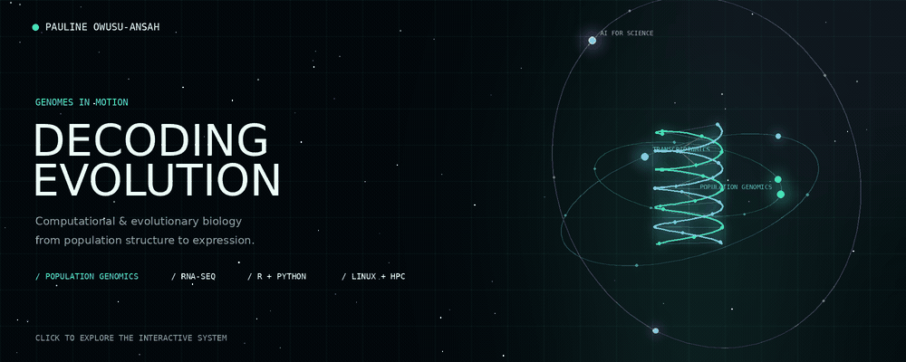
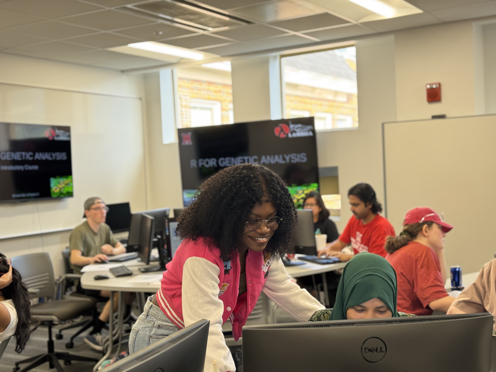

 
# Hi, I'm Pauline Owusu-Ansah
**PhD Candidate in Computational Biology | Population Genomics | Bioinformatics | Evolutionary Genomics**

Using genomic and computational approaches to investigate **species boundaries, gene flow, genomic divergence, population structure, and gene expression** in the Jezkova Lab (https://sites.miamioh.edu/jezkova-lab/) at **Miami University** (Ohio, USA).

My research combines **RADseq, population genomics, phylogenetics, spatial genomics, and RNA-seq** to understand evolutionary divergence in *Ambystoma* salamanders.

---

## What I do
I am a computational biologist with a strong focus on **population genomics**, **species delimitation**, and **gene flow analysis**. 
My work integrates **high-throughput sequencing data (RADseq, WGS)** with **phylogenetic and Bayesian modeling** to answer key questions in evolutionary biology.

### **Genomics & Bioinformatics**

**Tools & Pipelines** 
`ipyrad` · `BPP` · `ADMIXTURE` · `EEMS` · `PLINK` · `IQ-TREE` · `STRUCTURE` 

**Data Analysis & Visualization** 
`ggplot2` · `ggrepel` · `matplotlib` · `igraph` 

**Computing** 
High-Performance Computing (SLURM) · Linux/WSL · Conda Environments 

---

## Featured Projects
- **[Ambystoma Species Delimitation Pipeline](#)** → End-to-end RADseq workflow for delimiting *Ambystoma* salamanders using phylogenetics, Bayesian inference, and population structure.
- **[Bayesian IBD & Gene Flow Modeling](#)** → Spatial models detecting isolation-by-distance and asymmetric migration.
- **[LAMBDA Workshop Materials](#)** → R training resources for genomics, population genetics, and phylogenetic analysis.

---

## Current Focus
- Species boundaries and hybridization in *Ambystoma barbouri* & *A. texanum*
- Genomic data integration for conservation decisions
- Developing reproducible, open-source workflows for population genomics

---
  
## 🎤 Invited Talks & Science Communication

### Speaker @The Story Collider by SSE, 2024

In 2024, I was invited to speak at **The Story Collider** Society for the Study of Evolution Conference at Montreal, Canada, where I shared a personal science story connecting research, identity, persistence, and the human side of becoming a scientist.

<em>Invited speaker at The Story Collider, 2024.</em>

This experience strengthened my interests in:
- Public science communication
- Storytelling in science
- Communicating research to broad audiences
- Connecting scientific careers with lived experience
- Making science more accessible beyond academic settings
---
## 🎤 Presentations & Conferences
- **Poster Presentation – Socitey for Study of Evolution, Georgia (SSE 2025)**
*“Assessing Species Boundaries and Genetic Flow in Ambystoma barbouri and Ambystoma texanum"*.
- **Poster Acceptance – European Society for Evolutionary Biology (ESEB) 2025, Barcelona, Spain**
*“Species boundaries and gene flow in Ambystoma salamanders: Integrating field ecology with genomic analyses”* — Accepted for presentation but unable to attend due to visa constraints.
- **Invited Talk – Story Collider by Society for Study of Evolution (SSE) 2024**
Delivered a public science storytelling talk, sharing my journey in Evolutuionary Biology, highlighting the intersection of personal experiences and scientific work.

---

## 📚 Teaching Experience

- **Co-Instructor – LAMBDA Workshop (August 2025)**  

  *Genetics module* – 4-day training covering VCF analysis, phylogenetic trees, structure analysis, and population genetics in R.

- **Laboratory Tutor – Principles of Human Physiology (Fall 2023 – Spring 2026)**  

  Guided students through laboratory experiments, data analysis, and interpretation; held office hours to support learning.

## 👩🏾‍🏫 Teaching in Action

Teaching and scientific communication are an important part of my graduate training.

I have experience teaching undergraduate biology and computational research methods, including **Human Physiology & Anatomy** and **Genetic Analysis with R**.

<em>Teaching students how to use R for genomics and genetic analysis, LAMBDA WORKSHOP 2026.</em>

My teaching approach emphasizes:

- Making complex biological and computational concepts accessible
- Connecting theory with hands-on analysis
- Helping students interpret biological data
- Building confidence with R and scientific computing
- Encouraging reproducible research practices
- Supporting collaborative and inquiry-based learning

## 🌱 Field Research Experience
- **Salamander Ecology & Population Monitoring (Miami University – Ecology Research Center)**  
Conducted extensive field surveys to monitor *Ambystoma* salamander populations, focusing on breeding habitats, seasonal activity, and microhabitat conditions. Collected tissue samples, recorded environmental parameters (water quality, substrate type, vegetation cover), and documented population health indicators. These datasets serve as a critical ecological context for downstream genomic analyses.  

## 🏆Fellowship & Awards
- **Gundlach Theis Fellowship - USD$3,000 - Summer 2025** 
---

## Connect With Me
**linkedIn:** (https://www.linkedin.com/in/pauline-owusu-ansah-010250192?utm_source=share&utm_campaign=share_via&utm_content=profile&utm_medium=ios_app)
**Email:** (https://img.shields.io/badge/-Email-D14836?style=flat&logo=gmail&logoColor=white)](mailto:your-email@paulineowusu653@gmail.com.com)       
**X:** (https://x.com/yaafhanzy?s=11&t=EKXHHj1dJ2vqB5zLOt4V7A)

---
 _Committed to advancing genomics research that bridges biodiversity science and real-world applications._
